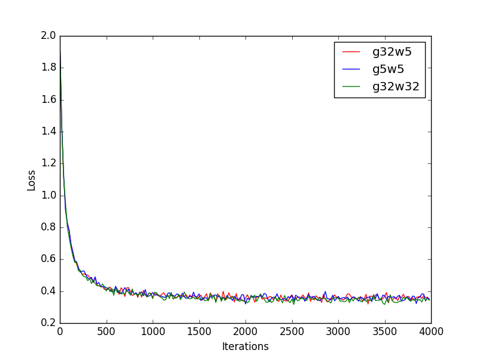
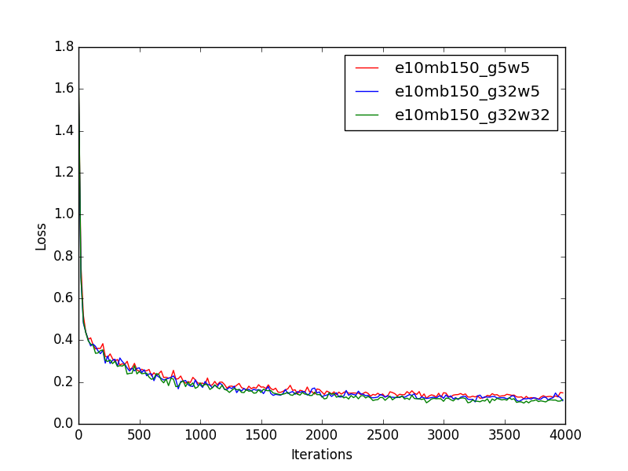
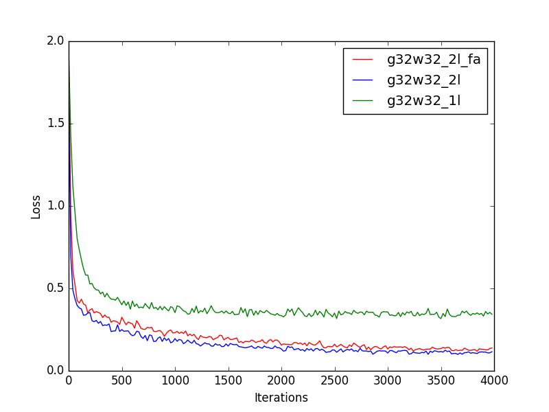

# MNIST linear regression

### Folder description
1. `ds`: MNIST data set
2. `exp_result`: training results; stores `.npy` files of weight *W* and *b*
3. `log`:  log files record loss in different epochs and iterations
4. `test_result`: testing results; stores *error rate* on test data set
5. `loss_plot`: plotting the loss for different numbe of layers

### Basic experiment settings for now
- total training data points: 60000
- total testing data points: 10000
- epoch: 10 or 1000
- minibatch size: 150 or 20
- precision: specified by `_g32w32`, `_g32w5` and `_g5w5` at the end of filename
- models: specified by `_2l` or nothing as for 2 layers or 1 layer
- experiment id: specified by the last number to represent duplicate exp with same hyperparameters

### Result
#### 1 layer:
- `_g5w5` precision: 8.04% error rate
- `_g32w5` precision: 8.24% error rate
- `_g32w32` precision: 7.94% error rate

#### 2 layers:
- `_g5w5` precision: 2.73% error rate
- `_g32w5` precision: 2.91% error rate
- `_g32w32` precision: 2.43% error rate
- `e1000mb20_g32w32` precision: 2.19% error rate

#### Feedback Alignment(FA):
- `_g32w32_2l` precision: 2.75% error rate

### Instruction for re-running
For example in file `linear_reg_low.py`, in function `main()`, there are two processes `trainProc()` and `testProc()`. Comment one and run `$python linear_reg_low.py` for either training and testing.

Note: When rerunning, files in folder `exp-result` will be overwritten, however, files in `log` or `test-result` will be appended if the parameters are the same.

