# MNIST linear regression

## Folder description
1. `ds`: MNIST data set
2. `exp_result`: training results; stores `.npy` files of weight *W* and *b*
3. `log`:  log files record loss in different epochs and iterations
4. `test_result`: testing results; stores *error rate* on test data set
5. `loss_plot`: plotting the loss for different numbe of layers
6. `code`: different code for different experiments

## Result
### Test 1:
#### Basic experiment settings for now
- total training data points: 60000
- total testing data points: 10000
- epoch: 10 or 1000
- minibatch size: 150 or 20
- precision: specified by `_g32w32`, `_g32w5` and `_g5w5` at the end of filename
- models: specified by `_2l` or nothing as for 2 layers or 1 layer
- experiment id: specified by the last number to represent duplicate exp with same hyperparameters

#### 1 layer:
- `_g5w5` precision: 8.04% error rate
- `_g32w5` precision: 8.24% error rate
- `_g32w32` precision: 7.94% error rate
<!--  -->

#### 2 layers:
- `_g5w5` precision: 2.73% error rate
- `_g32w5` precision: 2.91% error rate
- `_g32w32` precision: 2.43% error rate
- `e1000mb20_g32w32` precision: 2.19% error rate
<!--  -->
<!--  -->

#### Feedback Alignment(FA):
- `_g32w32_2l` precision: 2.75% error rate
<!--  -->
<!--  -->

#### Random Gradients(RG):
1. Fixed Random Gradients with Sign Concordant:
- Vary coefficient scales of gradients of `W`:

|No.    |gradient scale | gW   | gb   | learning rate |accuracy|loss |
|:---:  |:-------------:|:---: |:---: |:---:          |:---:   |:---:|
|`_rg_1`|uniform [0,1)  |0.01  |1     |1e-3           |19.5%   |1.34 |
|`_rg_2`|               |1     |      |               |4.07%   |0.18 |
|`_rg_3`|               |0.1   |      |               |8.38%   |0.34 |

> learning rate decay by 10 at iteration of No.`2000`, `3000` and `3500`

- Without learning rate decay:

|No.    |gradient scale | gW   | gb   | learning rate |accuracy|loss |
|:---:  |:-------------:|:---: |:---: |:---:          |:---:   |:---:|
|`_rg_4`|uniform [0,1)  | 1    |1     | 1e-3          |3.35%   |0.14 |

<!--  -->

-----------------------------

### Test 2:
#### Basic Experiment Setting:
- total training data points: 60000
- total testing data points: 10000
- training data points: 54000
- validation data points: 6000
- epoch: 100
- minibatch size: 120
- experiment id: specified by the last number to represent duplicate exp with same hyperparameters

#### Five comparable experiment settings:
1. SGD 
2. SGD with Momentum and Decay (SGD_md)
3. Batch Manhattan with Momentum and Decay (BM_md)
4. Batch Manhattan Scaled by a Random Matrix with Momentum and Decay (BM_Scale_md)
5. Batch Manhattan with Adam (BM_Adam)

#### Result:
-------------------------------
#### Single Worker:

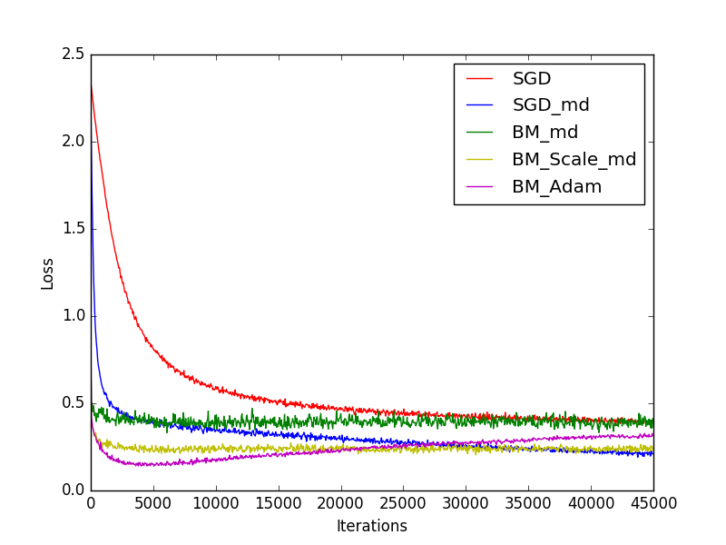
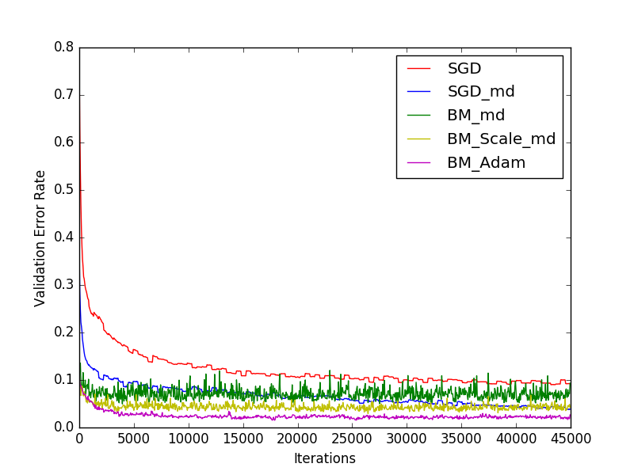

|Training Method   | Error Rate on Testset |
|:-------  |:-------------:|
|`SGD`|8.68% |
|`SGD_md`|  4.41%             |
|`BM_md`|         8.73%      |
|`BM_Scale_md`| 4.55%|
|`BM_Adam`| 2.98%|

--------------------------------
#### Simulate Multi Workers using average aggregation:

1.Experiment Setting 1

	Workers Num = 5
	Epoch Num = 100
	Minibatch Size per worker = 120

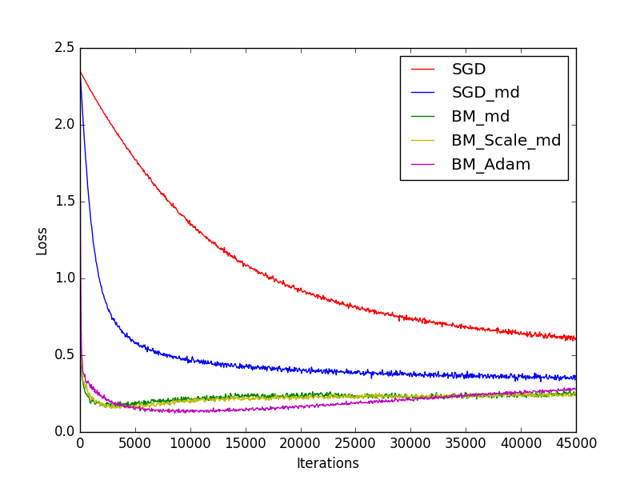
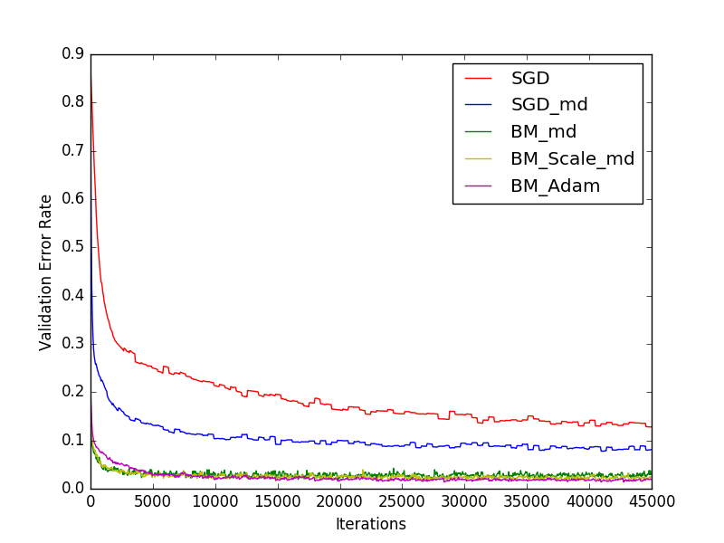

|Training Method   | Error Rate on Testset |
|:-------  |:-------------:|
|`SGD`|12.29% |
|`SGD_md`|  7.85%             |
|`BM_md`|         2.98%      |
|`BM_Scale_md`| 2.78%|
|`BM_Adam`| 2.39%|

2.Experiment Setting 2

	Workers Num = 3
	Epoch Num = 100
	Minibatch Size per worker = 40

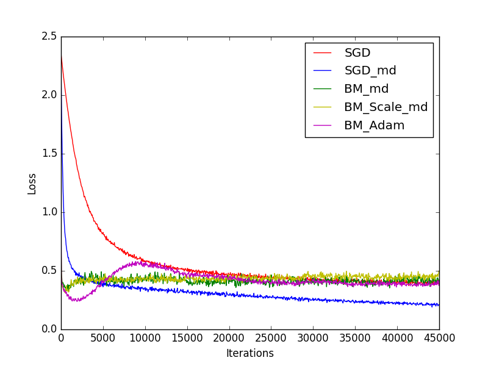
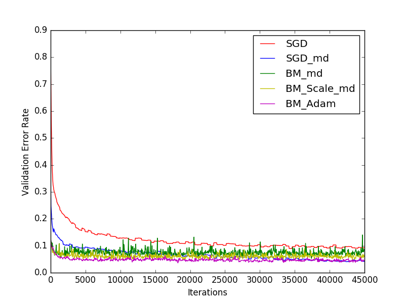

|Training Method   | Error Rate on Testset |
|:-------  |:-------------:|
|`SGD`|8.69% |
|`SGD_md`|  4.47%             |
|`BM_md`|         7.42%      |
|`BM_Scale_md`| 5.66%|
|`BM_Adam`| 4.77%|

3.Experiment Setting 3

	Workers Num = 3
	Epoch Num = 100
	Minibatch Size per worker = 80

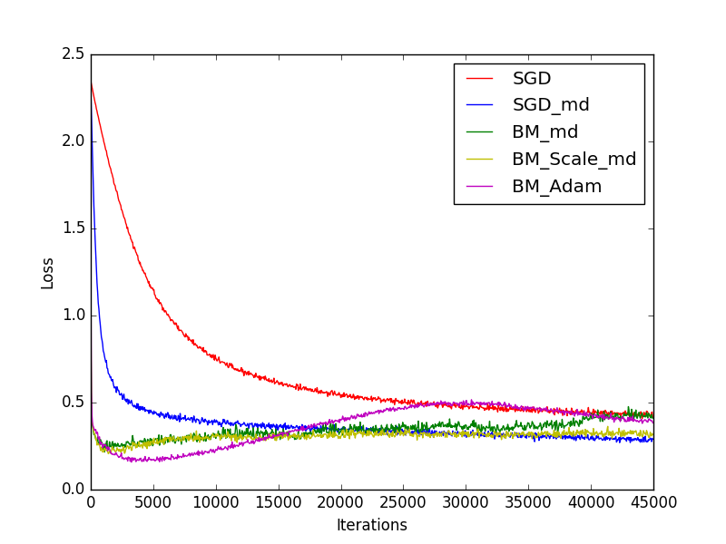
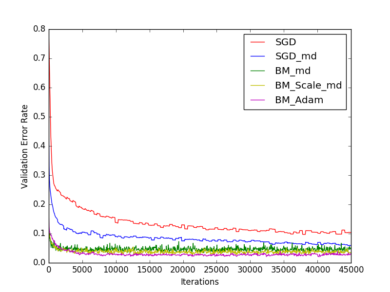

|Training Method   | Error Rate on Testset |
|:-------  |:-------------:|
|`SGD`|9.65% |
|`SGD_md`|  6.3%             |
|`BM_md`|   4.38%      |
|`BM_Scale_md`| 3.42%|
|`BM_Adam`| 3.48%|

-----------------------------------
#### Simulate Multi Workers using Majority Vote on Sign:

1.Experiment Setting 1

	Workers Num = 5
	Epoch Num = 100
	Minibatch Size per worker = 120

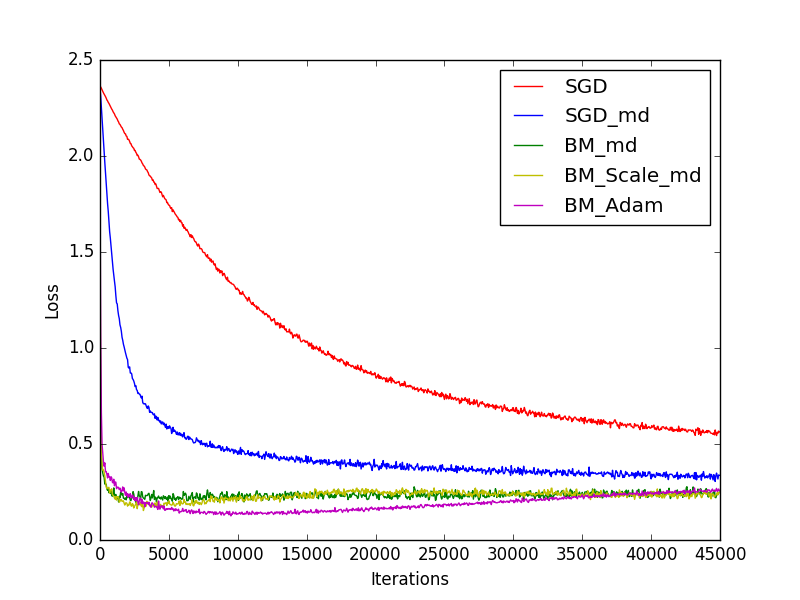
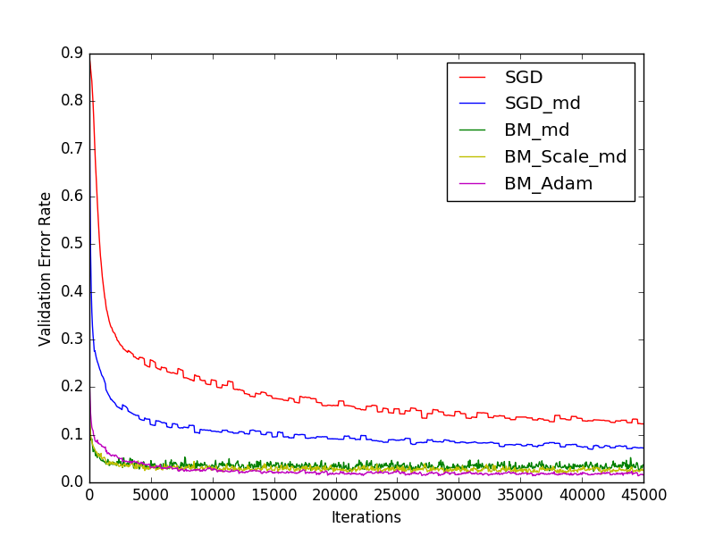

|Training Method   | Error Rate on Testset |
|:-------  |:-------------:|
|`SGD`| 11.51% |
|`SGD_md`|  7.21%             |
|`BM_md`|         3.96%      |
|`BM_Scale_md`| 2.92%|
|`BM_Adam`| 2.31%|

2.Experiment Setting 2

	Workers Num = 3
	Epoch Num = 100
	Minibatch Size per worker = 40

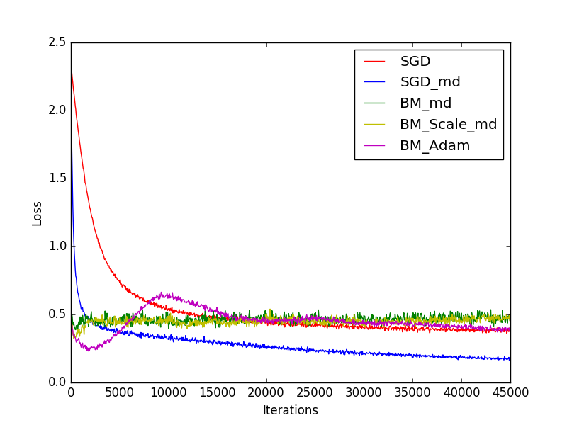
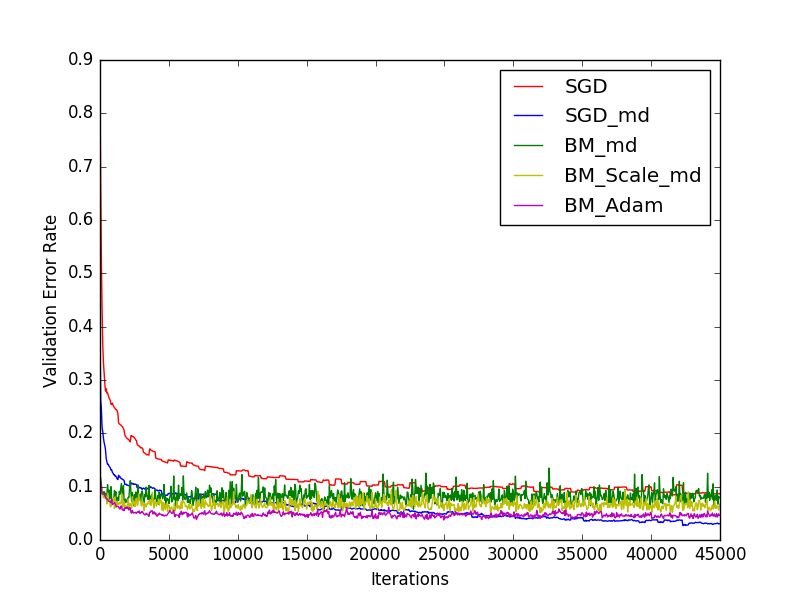

|Training Method   | Error Rate on Testset |
|:-------  |:-------------:|
|`SGD`|8.40% |
|`SGD_md`|  3.59%             |
|`BM_md`|         7.46%      |
|`BM_Scale_md`| 6.27%|
|`BM_Adam`| 4.44%|

## Instruction for re-running
For example in file `linear_reg_low.py`, in function `main()`, there are two processes `trainProc()` and `testProc()`. Comment one and run `$python linear_reg_low.py` for either training and testing.

Note: When rerunning, files in folder `exp-result` will be overwritten, however, files in `log` or `test-result` will be appended if the parameters are the same.

